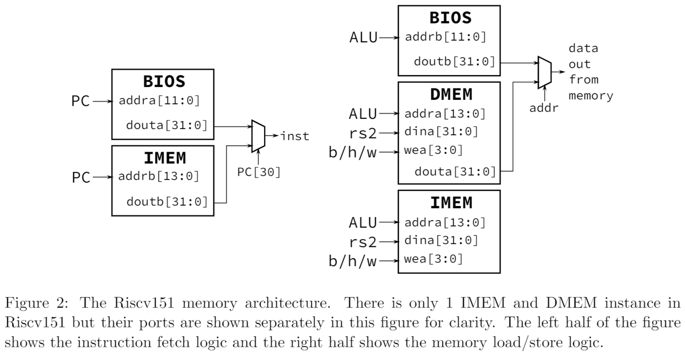

# 2022 Summer Vacation Bootcamp in Sangmyung University

## FPGA configuration for simulation

### FPGA SIMULATION Env. (Xilinx Version)

- below in run.f 

```bash
//////////////////////////    Xilinx Library Model     ////////////////////////
$XILINX_VIVADO/data/verilog/src/glbl.v
-y $XILINX_VIVADO/data/verilog/src/unisims        +libext+.v
-y $XILINX_VIVADO/data/verilog/src/retarget       +libext+.v

// -f $XILINX_VIVADO/data/secureip/gtxe2_channel/gtxe2_channel_cell.list.f
// -f $XILINX_VIVADO/data/secureip/gtxe2_common/gtxe2_common_cell.list.f
```

### FPGA SIMULATION Env. (Quartus Version)

- below in run.f
* Warning: you should change relative path

```bash
//////// INTEL FPGA LIBRARY /////
-v ../../sim_model/de2-115/sim_lib/220model.v
-v ../../sim_model/de2-115/sim_lib/altera_mf.v
-v ../../sim_model/de2-115/sim_lib/sgate.v
-v ../../sim_model/de2-115/sim_lib/cycloneive_atoms.v

+libext+.v+.vlib

```

## RISC-V Section

### Phase 0 hardware design spec
### Phase 1 hardware design spec - add CSR register & c_tests
- add CSR register 
    - mem_path.vh의 아래 주석을 지우고 경로대로  csr 레지스터 구현
        ```bash
        //`define CSR_PATH  CPU.icpu.i_datapath.tohost_csr
        ```
    -  csrw & csrwi 
    
    
    - Write 동작만 구현(csr = rs1, csr = ZeroExt(uimm))
    - 이후 테스트벤치의 CSR test 부분 주석을 해제하고 cpu_tb 시뮬레이션 진행
- c_test simultaion
    - phase1의 hardware 폴더안에 c_tests_tb 이용하여 시뮬레이션
    - phase1의 software 폴더안에 6개의 c_test를 각각 hex파일로 만들어 시뮬레이션 폴더에 복사하여 시뮬레이션 진행
    - 테스트 성공시 CSR test PASSED!, 테스트 실패시 CSR test FAILED!가 뜨면서 시뮬레이션이 종료됨
    - 6개의 테스트 모두 통과해야함
### Phase 2 hardware design spec - add peripheral test (timer, gpio)
- 고대 교수님이 쓰신 RISC-V 책 96p를 참조하여 phripheral을 다운로드
- 아래의 메모리맵을 참고하여 SMU_RV32I_System.v 에 어드레스 디코더와 주변장치 연결(GPIO 와 TimerCounter만 구현)
```bash
//======================================================================
// Address       Peripheral           Peripheral Name         Size
// 0xFFFF_FFFF  -------------   --------------------------      ---------
//
//                Reserved
//
// 0x8000_3000  -------------  
//                  GPIO         General Purpose IO            4KB
// 0x8000_2000  -------------
//                   TC              Timer Conter              4KB
// 0x8000_1000  -------------
// 
//                  UART           Universal                          
//                                 Asynchronous                4KB
//                                 Receive/ Transmitter
// 0x8000_0000  -------------                                
//                
//
//             ------------- 
// 0x4000_0000      BIOS                BIOS Memory
//
// 0x1000_2000  -------------                                
//                   Mem         Instruction & Data Memory     8KB
// 0x1000_0000  ------------- 
//                Reserved
// 0x0000_0000  -------------    
//=======================================================================
```
- 이후 phase2의 software 폴더안의 peripheral test 진행후 verdi를 통해 분석

### Phase 3 hardware design spec - PLL test on intel DE2-115 FPGA Board

``` bash
+incdir+../../model/verilog/Altera_PLL/
-y ../../model/verilog/Altera_PLL/
```

- when you use synchrous read/write memory, you check dualport_mem_synch_rw.sv file
### Phase 4 hardware design spec - Add UART & BIOS
1. Integrated UART
 - memory map address for UART
 

 - Note: You should change ADDRESS Decoder & Data mux

2. UART Test software
    1. echo program
        + check software directory: echo
        + check bench directory: echo_tb.v
    2. uart_parse program
        + check software directory: uart_parse
        + check bench directory: uart_parse_tb.v

* Note: You shoud verify RTL & FPGA Simulation
    - RTL baudrate : 1_000_000 in main clock 50MHz
    - FPGA baudrate : 19_200 in main clock 10MHz

3. BIOS design for user software download
  - Integrated BIOS memory
  - memory address & map structure
 
 

 - bios program
    + check software directory: bios
    + check bench directory: bios_tb.v

 * Note: You shoud verify RTL & FPGA Simulation
    - RTL baudrate : 1_000_000 in main clock 50MHz
    - FPGA baudrate : 19_200 in main clock 10MHz

4. Next phase 5


